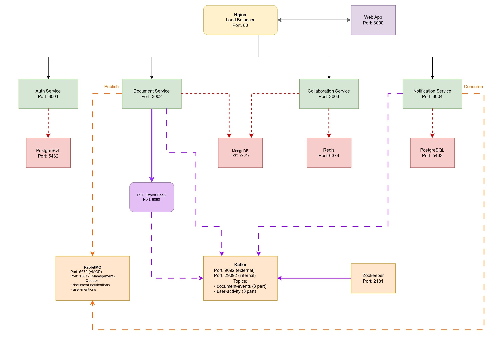
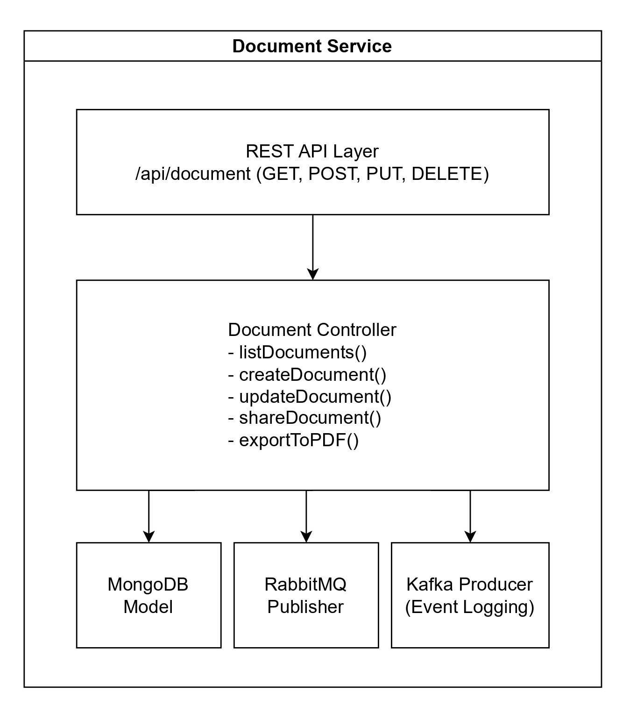
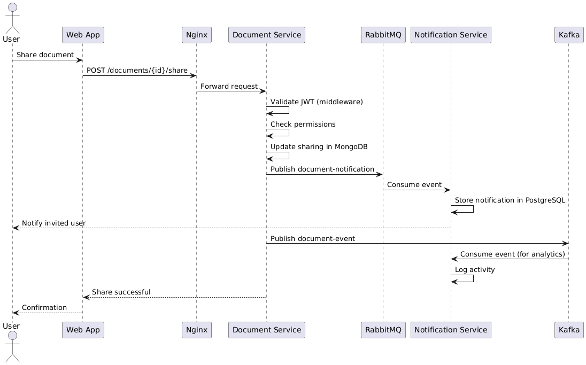

# Collaborative Workspace - Distributed System Project

## Project Overview

This is a **real-time collaborative document editing platform** built as a distributed microservices system. The application allows multiple users to create, edit, and share documents in real-time, with features like notifications and PDF export.

---

## Project Features

### **User Management**
- User registration with email validation
- Login with JWT token generation
- Secure password storage (bcrypt)

### **Document Management**
- Create, read, update, delete documents
- Folder organization
- Document tagging
- Full-text search
- Version tracking
- Last edited timestamp

### **Collaboration**
- Real-time multi-user editing
- Live cursor positions
- Active user presence

### **Sharing & Permissions**
- Share documents with other users
- Permission levels: read, write, admin
- Public/private documents
- Owner-only deletion

### **Notifications**
- Real-time notification updates
- Document shared notifications
- Mark as read functionality
- Notification history

### **Export**
- PDF generation on-demand
- Metadata inclusion (author, date, version)
- Serverless function execution

---

## Architecture Overview

The system follows a **microservices architecture** with the following key components:

### **Backend Services (4 Microservices)**
1. **Auth Service** - User authentication and authorization
2. **Document Service** - Document CRUD operations and management
3. **Collaboration Service** - Real-time editing with WebSockets
4. **Notification Service** - User notifications system

### **Infrastructure Components**
- **Nginx** - Load balancer for all services
- **Redis** - Session management and real-time state
- **RabbitMQ** - Message broker for async communication
- **Kafka** - Event streaming for audit logs
- **PostgreSQL** (2 instances) - Relational data for Auth & Notifications
- **MongoDB** - Document storage
- **FaaS Function** - PDF export serverless function

### **Frontend**
- **React Web App** with microfrontend architecture
- Deployed as containerized application

---

## Requirements

### 1. Web Server with Secured REST API

**Implementation:**
- All 4 microservices expose REST APIs
- JWT-based authentication implemented in all services
- Auth middleware validates tokens on protected routes

**Evidence:**
```javascript
// File: services/auth-service/src/middleware/authMiddleware.js
// JWT validation middleware protects all endpoints
const jwt = require('jsonwebtoken');

function authenticateToken(req, res, next) {
  const authHeader = req.headers['authorization'];
  const token = authHeader && authHeader.split(' ')[1];
  
  if (!token) {
    return res.status(401).json({ error: 'Access denied. No token provided.' });
  }

  try {
    const decoded = jwt.verify(token, JWT_SECRET);
    req.user = decoded;
    next();
  } catch (error) {
    return res.status(403).json({ error: 'Invalid or expired token' });
  }
}
```

**REST Endpoints Examples:**
- `POST /api/auth/register` - User registration
- `POST /api/auth/login` - User login (returns JWT)
- `GET /api/documents` - List user documents (secured)
- `POST /api/documents` - Create document (secured)
- `PUT /api/documents/:id` - Update document (secured)
- `GET /api/notifications` - Get notifications (secured)

---

### 2. Scalability - Load Balancer

**Implementation:**
- **Nginx** configured as reverse proxy and load balancer
- Load balancing algorithms: `least_conn` for most services, `ip_hash` for WebSocket service

**Evidence:**
```nginx
# File: nginx/nginx.conf
upstream auth_service {
    least_conn;  # Load balancing algorithm
    server auth-service:3001;
    # Ready to add more instances:
    # server auth-service-2:3001;
    # server auth-service-3:3001;
}

upstream collaboration_service {
    ip_hash;  # Sticky sessions for WebSocket connections
    server collaboration-service:3003;
}

server {
    listen 80;
    
    location /api/auth {
        proxy_pass http://auth_service;
    }
    
    location /socket.io/ {
        proxy_pass http://collaboration_service;
        proxy_http_version 1.1;
        proxy_set_header Upgrade $http_upgrade;
        proxy_set_header Connection "upgrade";
    }
}
```

**Scalability Features:**
- Multiple service instances can be added by uncommenting lines in nginx.conf
- Redis used for session management (shared state across instances)
- Stateless service design allows horizontal scaling

---

### 3. Message Broker - RabbitMQ

**Implementation:**
- RabbitMQ used for asynchronous communication
- Document sharing notifications sent via RabbitMQ
- Notification Service consumes messages from queue

**Evidence:**
```javascript
// File: services/document-service/src/config/rabbitmq.js
const amqp = require('amqplib');

// Publisher - sends notification when document is shared
async function notifyDocumentShared(documentId, title, fromUserId, toUserId, toUsername) {
  const channel = await getChannel();
  const queue = 'document-notifications';
  
  await channel.assertQueue(queue, { durable: true });
  
  const message = {
    type: 'DOCUMENT_SHARED',
    documentId,
    title,
    fromUserId,
    toUserId,
    toUsername,
    timestamp: new Date().toISOString()
  };
  
  channel.sendToQueue(queue, Buffer.from(JSON.stringify(message)), {
    persistent: true
  });
}
```

```javascript
// File: services/notification-service/src/consumers/rabbitmqConsumer.js
// Consumer - listens for messages and creates notifications
async function startConsumer() {
  const channel = await getChannel();
  const queue = 'document-notifications';
  
  await channel.assertQueue(queue, { durable: true });
  channel.prefetch(1);
  
  channel.consume(queue, async (msg) => {
    const data = JSON.parse(msg.content.toString());
    
    if (data.type === 'DOCUMENT_SHARED') {
      // Create notification in database
      await createNotification(
        data.toUserId,
        'Document Shared',
        `${data.toUsername} shared "${data.title}" with you`
      );
    }
    
    channel.ack(msg);
  });
}
```

**Communication Flow:**
1. User shares document -> Document Service
2. Document Service publishes message to RabbitMQ queue
3. Notification Service consumes message asynchronously
4. Notification created in database and sent to user

---

### 4. Event Streaming - Kafka

**Implementation:**
- Kafka used for event streaming and audit logging
- All document operations (create, update, delete, view, share) logged to Kafka
- Events stored in topics for analytics and compliance

**Evidence:**
```javascript
// File: services/document-service/src/config/kafka.js
const { Kafka } = require('kafkajs');

const kafka = new Kafka({
  clientId: 'document-service',
  brokers: [process.env.KAFKA_BROKER || 'kafka:29092']
});

const producer = kafka.producer();

// Log document creation event
async function logDocumentCreated(documentId, title, userId, username) {
  await producer.send({
    topic: 'document-events',
    messages: [{
      key: documentId,
      value: JSON.stringify({
        eventType: 'DOCUMENT_CREATED',
        documentId,
        title,
        userId,
        username,
        timestamp: new Date().toISOString()
      })
    }]
  });
}

// Log document update event
async function logDocumentUpdated(documentId, title, userId, username, changedFields) {
  await producer.send({
    topic: 'document-events',
    messages: [{
      key: documentId,
      value: JSON.stringify({
        eventType: 'DOCUMENT_UPDATED',
        documentId,
        title,
        userId,
        username,
        changedFields,
        timestamp: new Date().toISOString()
      })
    }]
  });
}
```

```javascript
// File: services/notification-service/src/consumers/kafkaConsumer.js
// Consumer - reads events for analytics/auditing
const consumer = kafka.consumer({ groupId: 'notification-service-group' });

async function startKafkaConsumer() {
  await consumer.subscribe({ topic: 'document-events', fromBeginning: false });
  
  await consumer.run({
    eachMessage: async ({ topic, partition, message }) => {
      const event = JSON.parse(message.value.toString());
      console.log('Received event:', event.eventType, event.documentId);
      
      // Could trigger real-time notifications, analytics, etc.
    }
  });
}
```

**Kafka Usage:**
- **Topics:** `document-events` for all document-related events
- **Producers:** Document Service sends events
- **Consumers:** Notification Service consumes for real-time processing

---

### 5. FaaS - Function as a Service

**Implementation:**
- Standalone serverless function for PDF export
- Invoked on-demand by Document Service

**Evidence:**
```javascript
// File: faas/pdf-export/handler.js
const express = require('express');
const PDFDocument = require('pdfkit');

let executionCount = 0; // Simulates FaaS execution tracking

// FaaS endpoint
app.post('/function/pdf-export', async (req, res) => {
  executionCount++;
  console.log(`[Execution #${executionCount}] PDF Export function triggered`);
  
  const { title, content, metadata } = req.body;
  
  // Generate PDF using PDFKit
  const doc = new PDFDocument();
  res.setHeader('Content-Type', 'application/pdf');
  doc.pipe(res);
  
  doc.fontSize(24).text(title, { align: 'center' });
  doc.fontSize(12).text(content);
  doc.end();
  
  console.log(`PDF generated in ${Date.now() - startTime}ms`);
});

// Metrics endpoint (simulates FaaS monitoring)
app.get('/metrics', (req, res) => {
  res.json({
    totalExecutions: executionCount,
    uptime: Math.floor((Date.now() - startTime) / 1000)
  });
});
```

```javascript
// File: services/document-service/src/controllers/documentController.js
// Invokes FaaS function
exports.exportToPDF = async (req, res) => {
  const faasUrl = process.env.FAAS_URL || 'http://pdf-export-function:8080';
  
  const response = await axios.post(`${faasUrl}/function/pdf-export`, {
    title: document.title,
    content: document.content,
    metadata: {
      author: document.ownerUsername,
      createdAt: document.createdAt
    }
  }, {
    responseType: 'arraybuffer',
    timeout: 30000
  });
  
  res.setHeader('Content-Type', 'application/pdf');
  res.send(response.data);
};
```

**FaaS Characteristics:**
- Stateless execution
- Event-driven (triggered by HTTP request)
- Execution metrics tracking
- Independent scaling

---

### 6. Web App Consuming REST + Server Notifications

**Implementation:**
- React-based Single Page Application
- Consumes all backend REST APIs
- Real-time server-side notifications via Socket.IO

**Evidence:**
```javascript
// File: web-app/src/components/DocumentList.js
// Consuming REST API
const fetchDocuments = async () => {
  const response = await axios.get('/api/documents', {
    headers: { Authorization: `Bearer ${token}` }
  });
  setDocuments(response.data.documents);
};

const createDocument = async () => {
  await axios.post('/api/documents', 
    { title: newDocTitle, content: '' },
    { headers: { Authorization: `Bearer ${token}` } }
  );
  fetchDocuments();
};
```

```javascript
// File: web-app/src/components/DocumentEditor.js
// Real-time collaboration via WebSocket
useEffect(() => {
  socket = io(WS_URL, {
    auth: { token }
  });
  
  socket.emit('join-document', documentId);
  
  // Server-side notification - real-time cursor positions
  socket.on('user-joined', (data) => {
    console.log(`${data.username} joined the document`);
    setActiveUsers(prev => [...prev, data]);
  });
  
  // Server-side notification - content changes
  socket.on('content-updated', (data) => {
    setContent(data.content);
  });
  
  return () => socket.disconnect();
}, [documentId]);

// Send updates to server
const handleContentChange = (newContent) => {
  setContent(newContent);
  socket.emit('update-content', { documentId, content: newContent });
};
```

**Features:**
- REST API consumption for CRUD operations
- WebSocket connection for real-time updates
- JWT authentication on all requests
- Server pushes updates to all connected clients

---

### 7. Microfrontend Architecture

**Implementation:**
- Application divided into independent, self-contained UI modules
- Each microfrontend has its own state, API calls, and styling
- Components can be developed and deployed independently

**Evidence:**
```javascript
// File: web-app/src/App.js
import DocumentList from './components/DocumentList';
import DocumentEditor from './components/DocumentEditor';
import NotificationsWidget from './microfrontends/NotificationsWidget'; // <- Microfrontend

function App() {
  return (
    <div className="app-layout">
      <main className="main-content">
        <Routes>
          <Route path="/documents" element={<DocumentList token={token} />} />
          <Route path="/documents/:id" element={<DocumentEditor token={token} />} />
        </Routes>
      </main>
      
      {/* Notifications Microfrontend - completely independent */}
      <aside className="notifications-sidebar">
        <NotificationsWidget token={token} />
      </aside>
    </div>
  );
}
```

```javascript
// File: web-app/src/microfrontends/NotificationsWidget.js
// Self-contained microfrontend with own state and API calls
function NotificationsWidget({ token }) {
  const [notifications, setNotifications] = useState([]);
  const [unreadCount, setUnreadCount] = useState(0);
  
  useEffect(() => {
    fetchNotifications();
    const interval = setInterval(fetchNotifications, 30000);
    return () => clearInterval(interval);
  }, []);
  
  const fetchNotifications = async () => {
    const response = await axios.get('/api/notifications', {
      headers: { Authorization: `Bearer ${token}` }
    });
    setNotifications(response.data.notifications);
  };
  
  return (
    <div className="notifications-widget">
      {/* Independent UI */}
    </div>
  );
}
```

**Microfrontend Characteristics:**
- **Independent:** NotificationsWidget has its own state, API calls, and lifecycle
- **Self-contained:** Has dedicated CSS file (NotificationsWidget.css)
- **Reusable:** Can be embedded anywhere in the application
- **Technology-agnostic:** Could be rewritten in different framework without affecting main app
- **Independent deployment:** Changes to notifications don't require rebuilding main app

**Additional Microfrontends:**
- Login component (`components/Login.js`)
- Document List component (`components/DocumentList.js`)
- Document Editor component (`components/DocumentEditor.js`)

---

### 8. Container Deployment - Docker

**Implementation:**
- Every service has its own Dockerfile
- Docker Compose orchestrates all containers
- Multi-container application with 13 services

**Evidence:**
```yaml
# File: docker-compose.yml
services:
  # Infrastructure
  postgres-auth:
    image: postgres:15-alpine
    environment:
      POSTGRES_DB: auth_db
      POSTGRES_USER: admin
      POSTGRES_PASSWORD: admin123
    networks:
      - collab-network

  mongodb:
    image: mongo:7
    networks:
      - collab-network

  redis:
    image: redis:7-alpine
    networks:
      - collab-network

  rabbitmq:
    image: rabbitmq:3-management-alpine
    ports:
      - "5672:5672"   # AMQP
      - "15672:15672" # Management UI
    networks:
      - collab-network

  kafka:
    image: confluentinc/cp-kafka:7.5.0
    depends_on:
      - zookeeper
    networks:
      - collab-network

  # Application Services
  auth-service:
    build: ./services/auth-service
    ports:
      - "3001:3001"
    depends_on:
      - postgres-auth
    networks:
      - collab-network

  document-service:
    build: ./services/document-service
    ports:
      - "3002:3002"
    depends_on:
      - mongodb
      - rabbitmq
      - kafka
    networks:
      - collab-network

  collaboration-service:
    build: ./services/collaboration-service
    ports:
      - "3003:3003"
    depends_on:
      - redis
      - mongodb
    networks:
      - collab-network

  notification-service:
    build: ./services/notification-service
    depends_on:
      - postgres-notification
      - rabbitmq
      - kafka
    networks:
      - collab-network

  # Load Balancer
  nginx:
    image: nginx:alpine
    volumes:
      - ./nginx/nginx.conf:/etc/nginx/nginx.conf
    ports:
      - "80:80"
    depends_on:
      - auth-service
      - document-service
      - collaboration-service
      - notification-service
    networks:
      - collab-network

  # FaaS
  pdf-export-function:
    build: ./faas/pdf-export
    ports:
      - "8080:8080"
    networks:
      - collab-network

  # Frontend
  web-app:
    build: ./web-app
    ports:
      - "3000:80"
    depends_on:
      - nginx
    networks:
      - collab-network

networks:
  collab-network:
    driver: bridge

volumes:
  postgres-auth-data:
  postgres-notification-data:
  mongodb-data:
  redis-data:
  rabbitmq-data:
  kafka-data:
```

**Dockerfile Example:**
```dockerfile
# File: services/auth-service/Dockerfile
FROM node:18-alpine

WORKDIR /app

COPY package*.json ./
RUN npm ci --only=production

COPY . .

EXPOSE 3001

CMD ["node", "src/server.js"]
```

**Deployment Commands:**
```bash
# Build all containers
docker-compose build

# Start entire system
docker-compose up -d

# Scale a service (example)
docker-compose up -d --scale document-service=3

# View logs
docker-compose logs -f

# Stop everything
docker-compose down
```

---

### 9. UML & C4 Models

#### **C4 Container Diagram**

*Figure 1: Complete system architecture showing all microservices, databases, and message infrastructure*

#### **C4 Component Diagram - Document Service**
<p align="center">
  
</p>
*Figure 2: Internal architecture of the Document Service showing the REST API layer, controller, and connections to MongoDB, RabbitMQ, and Kafka*

#### **Sequence Diagram - Document Sharing Flow**

*Figure 3: UML Sequence Diagram showing document sharing workflow*

---

## Technology Stack

### **Backend**
- **Runtime:** Node.js
- **Framework:** Express.js
- **Authentication:** JWT
- **WebSockets:** Socket.IO
- **Validation:** express-validator

### **Databases**
- **PostgreSQL:** Auth & Notifications (relational data)
- **MongoDB:** Document storage (schema-less)
- **Redis:** Session management, real-time state

### **Message Queue & Streaming**
- **RabbitMQ:** Async messaging (AMQP protocol)
- **Apache Kafka:** Event streaming & audit logs
- **Zookeeper:** Kafka coordination

### **Infrastructure**
- **Nginx:** Load balancer & reverse proxy
- **Docker & Docker Compose:** Containerization

### **Frontend**
- **React:** UI framework
- **React Router:** Client-side routing
- **Axios:** HTTP client
- **Socket.IO Client:** WebSocket client

### **FaaS**
- **PDFKit:** PDF generation library
- **Express:** HTTP server for function endpoint

---

## Data Flow Examples

### **Example 1: User Registration**
1. User fills registration form -> Web App
2. POST `/api/auth/register` -> Nginx
3. Nginx routes to Auth Service
4. Auth Service hashes password (bcrypt)
5. User stored in PostgreSQL
6. Returns success response
7. User redirected to login

### **Example 2: Creating a Document**
1. User clicks "New Document" -> Web App
2. POST `/api/documents` with JWT -> Nginx
3. Nginx validates and routes to Document Service
4. Document Service:
   - Validates JWT token
   - Creates document in MongoDB
   - **Publishes event to Kafka** (DOCUMENT_CREATED)
5. Returns document object
6. **Kafka Consumer** (Notification Service) processes event
7. Could trigger welcome notification or analytics

### **Example 3: Real-time Collaboration**
1. User opens document -> Web App
2. WebSocket connection to Collaboration Service
3. User joins document room (Socket.IO room)
4. Collaboration Service:
   - Stores active users in Redis (SET)
   - Broadcasts "user-joined" to room
5. User types -> `update-content` event sent via WebSocket
6. Collaboration Service:
   - Updates content in Redis cache
   - Broadcasts to all users in room
   - Async update to MongoDB
7. All connected users see changes in real-time

### **Example 4: Sharing a Document**
1. User clicks "Share" and enters username -> Web App
2. POST `/api/documents/:id/share` -> Document Service
3. Document Service:
   - Adds collaborator to MongoDB document
   - **Publishes to RabbitMQ** queue (DOCUMENT_SHARED)
   - **Publishes to Kafka** topic (DOCUMENT_SHARED event)
4. **RabbitMQ Consumer** (Notification Service):
   - Consumes message from queue
   - Creates notification in PostgreSQL
   - Notification appears in user's notification widget
5. Returns success to client

### **Example 5: Exporting to PDF**
1. User clicks "Export PDF" -> Web App
2. GET `/api/documents/:id/export` -> Document Service
3. Document Service:
   - Fetches document from MongoDB
   - **HTTP POST to FaaS** function with document data
4. FaaS function:
   - Generates PDF using PDFKit
   - Returns PDF binary data
5. Document Service streams PDF to client
6. Browser downloads PDF file

---

## Security Features

1. **JWT Authentication:** All protected routes require valid token
2. **Password Hashing:** Bcrypt with salt rounds
3. **CORS Configuration:** Controlled cross-origin access
4. **Helmet.js:** Security headers
5. **Input Validation:** express-validator on all inputs
6. **Role-Based Access:** Document ownership & collaborator permissions

---

## How to Run the Project

### **Prerequisites**
- Docker & Docker Compose installed
- Ports available: 80, 3000-3004, 5432-5433, 6379, 8080, 9092, 15672, 27017

### **Steps**

1. **Clone/Extract the project**
```bash
git clone https://github.com/steefy02/collaborative-workspace/
cd collaborative-workspace
```

2. **Build all containers**
```bash
docker-compose build
```

3. **Start all services**
```bash
docker-compose up -d
```

4. **Access the application**
- **Web App:** http://localhost:3000
- **Nginx Load Balancer:** http://localhost:80
- **RabbitMQ Management:** http://localhost:15672
- **Auth Service:** http://localhost:3001/health
- **Document Service:** http://localhost:3002/health
- **Collaboration Service:** http://localhost:3003/health
- **Notification Service:** http://localhost:3004/health
- **FaaS Function:** http://localhost:8080/health

5. **Test the system using Postman**

6. **Stop the system**
```bash
docker-compose down
```