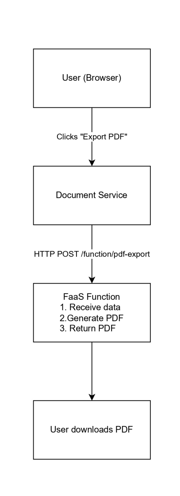

# Building a Serverless Function (FaaS) with Docker

**Tutorial: Creating On-Demand, Scalable Functions for Microservices**

**Working Example Repository:** https://github.com/steefy02/collaborative-workspace/

---

**About This Tutorial:**

This tutorial teaches Function as a Service (FaaS) concepts using a real-world example from a collaborative document editing system. While the principles and patterns discussed are general and applicable to any microservices architecture, the code examples are taken from an actual production implementation. You can clone the repository and run the complete system to see FaaS in action.

---

## Introduction: What is Function as a Service (FaaS)?

Function as a Service (FaaS) is a cloud computing model where code executes in response to events without the need to manage servers or infrastructure. Unlike traditional services that run continuously, FaaS functions are **stateless**, **event-driven**, and only consume resources during execution.

### Key Characteristics of FaaS

1. **Stateless Execution**: No data persists between invocations. Each execution is independent.
2. **Event-Driven**: Triggered by HTTP requests, message queues, scheduled events, or file uploads.
3. **Auto-Scaling**: Each invocation can run in parallel. No manual scaling configuration needed.
4. **Pay-Per-Execution**: Cost is based on actual usage (execution time + memory), not uptime.
5. **Short-Lived**: Functions execute quickly and terminate. Typical execution: milliseconds to minutes.

### Real-World Examples

Popular FaaS platforms include AWS Lambda, Google Cloud Functions, and Azure Functions. Common use cases:

- **Image/PDF Processing**: Generate thumbnails, convert formats, create documents
- **Data Transformation**: ETL pipelines, format conversion, validation
- **Webhooks**: Process incoming webhooks from third-party services
- **Scheduled Tasks**: Cron-like jobs, batch processing, cleanup operations
- **API Backends**: Lightweight REST endpoints that don't need always-on servers

### FaaS vs Traditional Microservices

| Feature | Traditional Microservice | FaaS Function |
|---------|-------------------------|---------------|
| **Availability** | Always running (24/7) | On-demand only |
| **State** | Can maintain state | Stateless required |
| **Cost Model** | Fixed (regardless of usage) | Pay per execution |
| **Scaling** | Manual configuration | Automatic & instant |
| **Cold Start** | None | Yes (first invocation) |
| **Best For** | Continuous workloads | Sporadic tasks |
| **Resource Usage** | Constant | Proportional to load |

**When to Use FaaS:**
- Tasks that run occasionally (not continuously)
- CPU-intensive operations (rendering, processing, generation)
- Variable workload patterns (unpredictable traffic)
- Cost optimization (pay only for actual usage)

**When NOT to Use FaaS:**
- Long-running processes (>15 minutes)
- Stateful applications requiring persistent connections
- Operations requiring low latency (cold starts add delay)
- Applications with steady, predictable load

### Example Use Case: PDF Export in a Collaborative Workspace

To demonstrate FaaS concepts, we'll examine a **PDF export function** from a real collaborative document editing system (similar to Google Docs). In this system, users create and edit documents, and occasionally need to export them as PDFs for sharing or archiving.

The PDF generation function:

- Accepts document data via HTTP POST
- Generates a formatted PDF using PDFKit
- Returns the PDF as a binary response
- Tracks execution metrics (count, timing, uptime)
- Runs in a Docker container (portable, isolated)

**System Architecture:**

In the collaborative workspace system, the architecture looks like this:
<p align="start">

</p>

- Document Service handles all document operations (CRUD, sharing, collaboration)
- PDF export is isolated in a separate FaaS function
- Function only runs when a user requests PDF export

---

## Implementation: The FaaS Function

The following code is taken from the collaborative workspace project. The complete system includes multiple microservices, but we'll focus specifically on the FaaS PDF export function.

**File Location in Repository:** `faas/pdf-export/handler.js`

### 1. Function Code (handler.js)

Our FaaS function is a Node.js application that exposes HTTP endpoints. The main function endpoint generates PDFs on-demand.

```javascript
const express = require('express');
const PDFDocument = require('pdfkit');

const app = express();
const PORT = process.env.PORT || 8080;

// Middleware
app.use(express.json({ limit: '10mb' }));

// ============================================
// FaaS Metrics (Execution Tracking)
// ============================================
let executionCount = 0;
const startTime = Date.now();

// ============================================
// Health Check Endpoint
// ============================================
app.get('/health', (req, res) => {
  res.json({ 
    status: 'OK', 
    service: 'pdf-export-function',
    executions: executionCount,
    uptime: Math.floor((Date.now() - startTime) / 1000) + 's',
    timestamp: new Date().toISOString()
  });
});

// ============================================
// Main FaaS Function Endpoint
// ============================================
app.post('/function/pdf-export', async (req, res) => {
  const functionStartTime = Date.now();
  executionCount++;

  console.log(`[Execution #${executionCount}] PDF Export function triggered`);

  try {
    const { title, content, metadata } = req.body;

    // Input Validation
    if (!title || !content) {
      return res.status(400).json({ 
        error: 'Missing required fields: title and content' 
      });
    }

    console.log(`Generating PDF for document: "${title}"`);

    // Create PDF Document
    const doc = new PDFDocument({
      size: 'A4',
      margins: { top: 50, bottom: 50, left: 50, right: 50 }
    });

    // Set Response Headers
    res.setHeader('Content-Type', 'application/pdf');
    res.setHeader('Content-Disposition', 
      `attachment; filename="${title.replace(/[^a-z0-9]/gi, '_')}.pdf"`);

    // Pipe PDF to Response (streaming)
    doc.pipe(res);

    // Add Title
    doc.fontSize(24)
       .fillColor('#333333')
       .text(title, { align: 'center' })
       .moveDown(0.5);

    // Add Metadata
    if (metadata) {
      doc.fontSize(10)
         .fillColor('#666666');
      
      if (metadata.author) {
        doc.text(`Author: ${metadata.author}`);
      }
      if (metadata.createdAt) {
        doc.text(`Created: ${new Date(metadata.createdAt).toLocaleDateString()}`);
      }
      if (metadata.version) {
        doc.text(`Version: ${metadata.version}`);
      }
      
      doc.moveDown(1);
    }

    // Add Horizontal Line
    doc.moveTo(50, doc.y)
       .lineTo(545, doc.y)
       .stroke('#cccccc')
       .moveDown(1);

    // Add Content
    doc.fontSize(12)
       .fillColor('#000000')
       .text(content, {
         align: 'left',
         lineGap: 4
       });

    // Add Footer with Page Numbers
    const pageCount = doc.bufferedPageRange().count;
    for (let i = 0; i < pageCount; i++) {
      doc.switchToPage(i);
      doc.fontSize(8)
         .fillColor('#999999')
         .text(
           `Page ${i + 1} of ${pageCount}`,
           50,
           doc.page.height - 50,
           { align: 'center' }
         );
    }

    // Finalize PDF
    doc.end();

    const executionTime = Date.now() - functionStartTime;
    console.log(`[Execution #${executionCount}] PDF generated successfully in ${executionTime}ms`);

  } catch (error) {
    console.error('Error generating PDF:', error);
    
    // If headers already sent (streaming started), can't send JSON error
    if (res.headersSent) {
      return res.end();
    }
    
    res.status(500).json({ 
      error: 'Failed to generate PDF',
      message: error.message 
    });
  }
});

// ============================================
// Metrics Endpoint (FaaS Monitoring)
// ============================================
app.get('/metrics', (req, res) => {
  const uptimeSeconds = (Date.now() - startTime) / 1000;
  
  res.json({
    service: 'pdf-export-function',
    totalExecutions: executionCount,
    uptime: Math.floor(uptimeSeconds),
    uptimeFormatted: formatUptime(uptimeSeconds),
    averageExecutionsPerMinute: uptimeSeconds > 0 
      ? (executionCount / (uptimeSeconds / 60)).toFixed(2) 
      : 0,
    lastExecution: executionCount > 0 ? 'Recently' : 'Never'
  });
});

function formatUptime(seconds) {
  const hours = Math.floor(seconds / 3600);
  const minutes = Math.floor((seconds % 3600) / 60);
  const secs = Math.floor(seconds % 60);
  return `${hours}h ${minutes}m ${secs}s`;
}

// ============================================
// 404 Handler
// ============================================
app.use((req, res) => {
  res.status(404).json({ error: 'Function endpoint not found' });
});

// ============================================
// Start Server
// ============================================
app.listen(PORT, '0.0.0.0', () => {
  console.log(`PDF Export Function (FaaS) running on port ${PORT}`);
  console.log(`Ready to handle requests at POST /function/pdf-export`);
  console.log(`Health check available at GET /health`);
  console.log(`Metrics available at GET /metrics`);
});
```

**Key FaaS Principles Demonstrated:**

1. **Stateless**: No data stored between requests. Each execution is independent.
2. **Metrics Tracking**: `executionCount` and timing show FaaS monitoring patterns.
3. **Single Responsibility**: Function does one thing: generate PDFs.
4. **Error Handling**: Proper HTTP status codes and error messages.
5. **Streaming**: PDF is streamed to response (memory-efficient).
6. **Fast Execution**: Optimized for quick response times.

### 2. Containerizing the Function

**File Location:** `faas/pdf-export/Dockerfile`

The function is containerized using Docker for portability and isolation.

**Dockerfile:**

```dockerfile
# Use lightweight Node.js image
FROM node:18-alpine

# Set working directory
WORKDIR /app

# Copy package files
COPY package*.json ./

# Install production dependencies only
RUN npm ci --only=production

# Copy function code
COPY handler.js ./

# Expose function port
EXPOSE 8080

# Health check (optional but recommended)
HEALTHCHECK --interval=30s --timeout=3s --start-period=5s --retries=3 \
  CMD node -e "require('http').get('http://localhost:8080/health', (r) => process.exit(r.statusCode === 200 ? 0 : 1))"

# Run the function
CMD ["node", "handler.js"]
```

### 3. Invoking the Function from a Service

In the collaborative workspace system, the Document Service is responsible for all document operations. When a user requests a PDF export, the Document Service invokes the FaaS function.

**File Location:** `services/document-service/src/controllers/documentController.js`

**Caller Service (Document Service):**

```javascript
const axios = require('axios');
const express = require('express');

const app = express();
app.use(express.json());

// Environment configuration
const FAAS_URL = process.env.FAAS_URL || 'http://pdf-export-function:8080';

// ============================================
// Export Document to PDF Endpoint
// ============================================
app.get('/api/documents/:id/export', async (req, res) => {
  try {
    const documentId = req.params.id;
    
    // 1. Fetch document from database
    const document = await fetchDocumentFromDB(documentId);
    
    if (!document) {
      return res.status(404).json({ error: 'Document not found' });
    }

    console.log(`Calling FaaS to generate PDF for document: ${documentId}`);

    // 2. Call FaaS Function
    const response = await axios.post(
      `${FAAS_URL}/function/pdf-export`, 
      {
        title: document.title,
        content: document.content,
        metadata: {
          author: document.ownerUsername,
          createdAt: document.createdAt,
          version: document.version
        }
      }, 
      {
        responseType: 'arraybuffer',  // Binary data
        timeout: 30000,  // 30 second timeout
        maxContentLength: 50 * 1024 * 1024,  // 50MB max
      }
    );

    // 3. Stream PDF to client
    res.setHeader('Content-Type', 'application/pdf');
    res.setHeader('Content-Disposition', 
      `attachment; filename="${document.title.replace(/[^a-z0-9]/gi, '_')}.pdf"`);
    res.send(response.data);

    console.log(`PDF generated successfully for document: ${documentId}`);

  } catch (error) {
    console.error('Export PDF error:', error.message);
    
    // Handle different error types
    if (error.code === 'ECONNREFUSED') {
      return res.status(503).json({ 
        error: 'PDF generation service unavailable',
        details: 'FaaS function is not responding'
      });
    }
    
    if (error.code === 'ETIMEDOUT') {
      return res.status(504).json({ 
        error: 'PDF generation timeout',
        details: 'Function execution took too long'
      });
    }
    
    if (error.response) {
      return res.status(error.response.status).json({ 
        error: 'FaaS function error', 
        details: error.response.data 
      });
    }
    
    res.status(500).json({ 
      error: 'Failed to export document',
      details: error.message 
    });
  }
});

// Mock database function (replace with real DB query)
async function fetchDocumentFromDB(id) {
  return {
    id: id,
    title: 'Sample Document',
    content: 'This is the document content that will be converted to PDF.',
    ownerUsername: 'john_doe',
    createdAt: new Date(),
    version: 1
  };
}

app.listen(3002, () => {
  console.log('Document Service running on port 3002');
  console.log(`Configured to use FaaS at: ${FAAS_URL}`);
});
```

**Error Handling:**

1. **Connection Errors** (ECONNREFUSED): FaaS function is down -> Return 503 Service Unavailable
2. **Timeout Errors** (ETIMEDOUT): Function took too long -> Return 504 Gateway Timeout
3. **Function Errors** (4xx/5xx from FaaS): Pass through error -> Return same status code
4. **Network Errors**: Catch-all -> Return 500 Internal Server Error

---

## Running & Scaling the Function

### 1. Docker Compose Setup

The collaborative workspace project uses Docker Compose to orchestrate all services. Below is the relevant configuration for the FaaS function and Document Service.

**File Location:** `docker-compose.yml`

**docker-compose.yml:**

```yaml
version: '3.8'

services:
  # The FaaS Function
  pdf-export-function:
    build: ./faas/pdf-export
    container_name: pdf-export-function
    environment:
      NODE_ENV: production
      PORT: 8080
    ports:
      - "8080:8080"
    networks:
      - faas-network
    restart: unless-stopped
    # Resource limits (optional but recommended)
    deploy:
      resources:
        limits:
          cpus: '1.0'
          memory: 512M
        reservations:
          cpus: '0.5'
          memory: 256M

  # The Calling Service
  document-service:
    build: ./document-service
    container_name: document-service
    environment:
      NODE_ENV: development
      PORT: 3002
      FAAS_URL: http://pdf-export-function:8080
    ports:
      - "3002:3002"
    depends_on:
      - pdf-export-function
    networks:
      - faas-network
    restart: unless-stopped

networks:
  faas-network:
    driver: bridge
```

**Starting the System:**

```bash
# Clone the collaborative workspace repository
git clone https://github.com/steefy02/collaborative-workspace/
cd collaborative-workspace

# Build all containers (includes all microservices + FaaS function)
docker-compose build

# Start the entire system
docker-compose up -d

# Check FaaS function health specifically
curl http://localhost:8080/health

```

### Conclusion

This tutorial presents FaaS concepts using a real-world implementation from a collaborative document editing system. The PDF export function showcases how FaaS enables:

1. **On-demand execution** - Runs only when users request PDF export
2. **Resource efficiency** - No idle CPU/memory consumption
3. **Isolation** - CPU-intensive PDF generation doesn't affect other services
4. **Scalability** - Can handle variable workload (0 to 1000s of requests)
5. **Cost optimization** - Pay only for actual usage